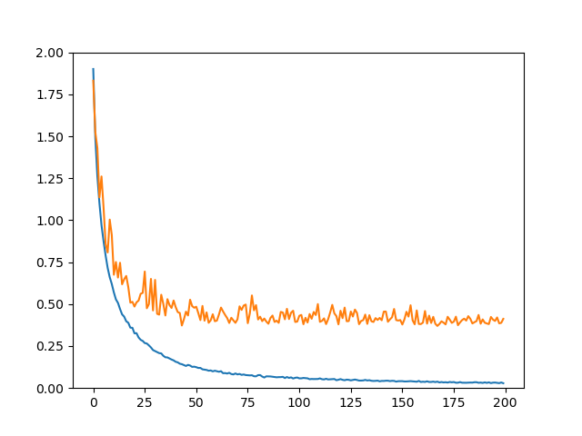
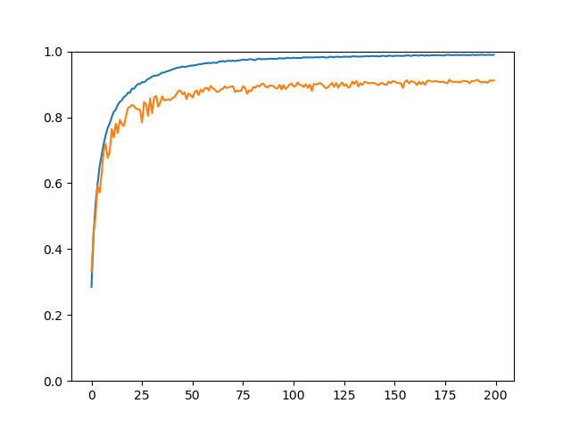

# Classification
pytorchの復習のために作成した、Cifar10のCNN Classificationのプログラムです。
無駄にデータパラレルに対応しています。

# Result

## Train/ Val
* Loss


* Accuracy


## Test
```console
plane: 934/1000 (93.40%)
car: 968/1000 (96.80%)
bird: 905/1000 (90.50%)
cat: 784/1000 (78.40%)
deer: 935/1000 (93.50%)
dog: 936/1000 (93.60%)
frog: 933/1000 (93.30%)
horse: 949/1000 (94.90%)
ship: 956/1000 (95.60%)
truck: 955/1000 (95.50%)

SUM: 9255/10000 (92.55%)
```